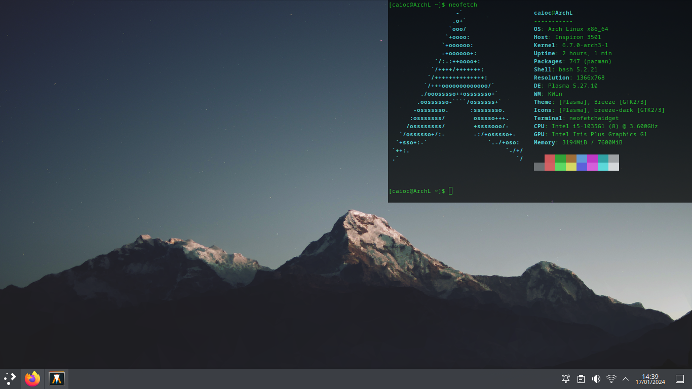

# Neofetch Widget

Simple terminal emulador.



This terminal emulator promps up in the screen with a small, borderless and iconless window, calling immediately the neofetch application.

Still you can use it to call any bash command or installed package. The default working directory for this terminal is your home `~/`, it doesn't change if you call the application from another path.

To close the widget you can call the `exit` bash command.

## Requirements

* g++ compiler
* [Neofetch][]
* [qtermwidget][]
* [Make][] (for compiling)

## Compiling

Using the [Makefile][], call:

```Make
    Make neofetchwidget
```

The resulting binary will pop up in the [bin folder][] by the name of `neofetchwidget`.

## Customize

You can customize some simple features as the:

* Width and Height of the terminal window;
* The X and Y positions where the window will pop on the screen;
* The Opacity of the window.

To change it you can open the [source file][] and modify the first lines:

```cpp
    #define W 600           //Width, uint
    #define H 400           //Height, uint
    #define X 766           //X position, uint
    #define Y 0             //Y position, uint
    #define OPACITY 0.7     //Opacity, float between 0 and 1
```

Some other features can be customized if you dig in the code:

* like the font family;
* font size; 
* terminal color scheme; 
* working directory; 
* and even the neofetch call.

[Neofetch]: https://github.com/dylanaraps/neofetch
[qtermwidget]: https://github.com/lxqt/qtermwidget
[Make]: https://www.gnu.org/software/make/manual/make.html

[Makefile]:/Makefile
[bin folder]: /bin/
[source file]: /src/neofetchwidget.cpp
